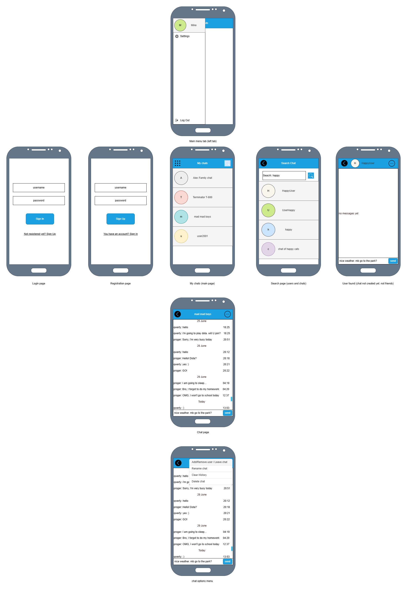

### X messenger - app client aprt


#### Подготовка:
1. download json libs and put it into ./app/gradle/...
2. git clone + open this app dir (./app/) in the Android Studio
3. add 3-party libs to /app/build.gradle dependencies: okhttp for http-request and json; also sha1
	dependencies {
    	implementation("com.squareup.okhttp3:okhttp:5.1.0")
		...
	}

#### Алгоритм при создании проекта с нуля:
```
Create new project
	Template: No Activity
	Name: Xmsg
	Language: Java
	Minimum SDK: API 26 ("Oreo"; Android 8.0)
	Build Configuration language: Groovy DSL (build.gradle)
project files tree
	1. app/res/layout - right click > New > Activity > Basic Views Activity
		Activity Name: LoginActivity
		Layout name: activity_login
		tick 'Launcher Activity' - YES
		+
		Rename
			FirstFragment to LoginFragment.java
			SecondFragment to RegFragment.java
			fragment_first.xml to fragment_login.xml
			fragment_second.xml to fragment_reg.xml
	2. app/res/layout - right click > New > Activity > Basic Views Activity
		Activity Name: MainActivity
		Layout name: activity_main
		tick 'Launcher Activity' - NO
		+
		Rename
			FirstFragment to AllchatsFragment.java
			SecondFragment to ChatFragment.java
			fragment_first.xml to fragment_allchats.xml
			fragment_second.xml to fragment_chat.xml
3. okhttp3: add 3-party lib to /app/build.gradle dependencies
	dependencies {
		implementation("com.squareup.okhttp3:okhttp:5.1.0")
		...
	}
```


#### Мокапы:
[Схема (файл)](docs/xmsg-cli-mockups.drawio): открывается и редактируется в draw.io (он же https://app.diagrams.net)<br>
 <br>
